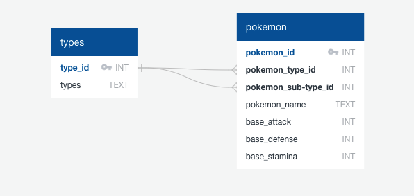
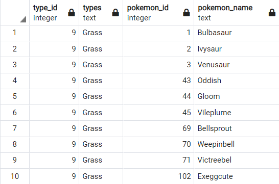

# ETL-Project - Pokemon

In the Pokemon world, new things are constantly happening and there are new releases, new Pokemon, and so many other things that are constantly happening; it’s so hard to keep track of everything that is happening in this dynamic world!

## 2 sources of data:
o	https://www.kaggle.com/abcsds/pokemon

o	https://rapidapi.com/Chewett/api/pokemon-go1?endpoint=apiendpoint_5ffb69ae-4d59-4136-b69e-de329fb1c1cb

## Why this data?
o	Get the types of Pokemon and calling on the API to get updates on new releases

## How could it be integrated into future projects?
o	Help come up with evolutions of new pokemon

o	Lucrative business that has been around for over 3 decades

## Extract Stage:
o	Taking our data source from kaggle.com and loading them into pandas

o	Calling the API key

## Transform Stage:
o	Dropping null values

o	Using .group_by for types of Pokemon

o	Add key for types from data grabbed from the API

o	Utilizing for loops to call on multiple categories/columns

## Load Stage:
o	Utilizing SQL as the program for the project

o	These are two relational databases

